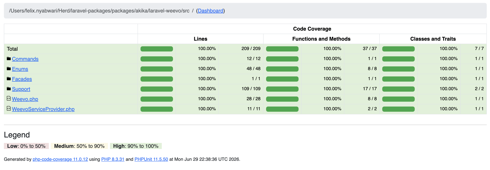

## Laravel Weevo Package by [Akika Digital](https://akika.digital)

The Laravel Weevo package allows you to transfer money through the NCBA Open Banking APIs. The package supports Laravel version 5 and above.

## Installation

You can install the package via composer:

```bash
composer require akika/laravel-weevo
```

After installing the package, publish the configuration file using the following command:

```bash
php artisan weevo:install
```

## ENV Variables

You can add the following variables to your env file. Make sure to add the requested information.

```bash
WEEVO_ENV=production
WEEVO_DEBUG=true
WEEVO_USERNAME=
WEEVO_API_KEY=
WEEVO_API_SECRET=
WEEVO_VERIFY_SSL=true #Option to validate. Make it false for local tests
WEEVO_TIMEOUT=30 # Default is 30
WEEVO_TOKEN_TTL=3300 # Used by the token. Default is 3300
WEEVO_RETRY_TIMES=2
WEEVO_RETRY_SLEEP=500
WEEVO_SANDBOX_URL=https://sandbox.example.com/api
WEEVO_PRODUCTION_URL=https://example.com/api
```

## Initialize library

Use the following snippet to use credentials in the config file

```php
Weevo::default();
```

Use the following snippet to define the variables. Fit for multivendor support

```php
$credentials = [
    'username' => 'CUSTOM_USERNAME',
    'api_key' => 'CUSTOM_API_KEY',
    'api_secret' => 'CUSTOM_API_SECRET',
];
Weevo::using($credentials);
```

## Create Delivery

Use the following function to create a delivery

```php
$sampleDeliveryData = [
    "externalId" => "1234562",
    "externalShipmentId" => "1234562",
    "branch" => 'WB-00001',
    "rider" => null, //"WR-00007", // If not set, the system will assign the rider
    "dropoff" => [
        "name" => "Jane Smith",
        "phone" => "+254700000001",
        "email" => "janesmith@example.com",
        "address" => "456 Elm St, Nairobi",
        "latitude" => -1.2921,
        "longitude" => 36.8219
    ],
    'orderValue' => 300, // Optional
    "package" => [
        "weight" => 1.5,
        "dimensions" => [
            "length" => 30,
            "width" => 20,
            "height" => 10
        ]
    ],
    'items' => [ // Optional
        [
            "name" => "Item 1",
            "sku" => "123234234",
            "quantity" => 1,
            "unitPrice" => 100
        ],
        [
            "name" => "Item 2",
            "sku" => "123234235",
            "quantity" => 2,
            "unitPrice" => 200
        ]
    ],
    'vehicleType' => 'motor_bike', // Optional: bike, motorcycle, car, van, truck
    'amountCharged' => 300, // Optional
    'instructions' => 'Deliver on time', // As requested by the customer
    'slotStartAt' => '2024-06-01 10:00:00', // Optional
    'slotEndAt' => '2024-06-01 12:00:00', // Optional
    'invoicedAt' => '2024-06-01 09:00:00', // Optional
    'deliveryMode' => 'standard', // Optional
    'paymentReceivedAt' => '2024-06-01 08:00:00', // Optional
];
$response = Weevo::default()->createDelivery($sampleDeliveryData);
```

## Get delivery details

To show delivery details, pass the trip_id in the function below:

```php
$response = Weevo::default()->getDelivery("TRIP-260630-003101-7054");
```

## Update Payment Status

Pass the data as shown below to update the delivery payment status

```php
$result = Weevo::default()->updatePaymentStatus(
    "TRIP-260630-003101-7054",
    [
        'paymentStatus' => 'paid', // Example update data
        'paymentReceivedAt' => '2024-06-01 08:00:00' // Example update data
    ]
);
```

## Delivery Statuses

Below are the available statuses

```php
case Pending = 'pending';
case Assigned = 'assigned';
case Picked = 'picked';
case InTransit = 'in_transit';
case DeliveryInitiated = 'delivery_initiated';
case PaymentRequested = 'payment_requested';
case Delivered = 'delivered';
case Failed = 'failed';
case Cancelled = 'cancelled';
case Returning = 'returning';
case Returned = 'returned';
```

## Quality Assurance

The package is fully tested using Pest PHP and PHPUnit.

### Test Coverage

Current test coverage:

- ✅ 100% Line Coverage
- ✅ 100% Method Coverage
- ✅ 100% Class Coverage

Main coverage report:


